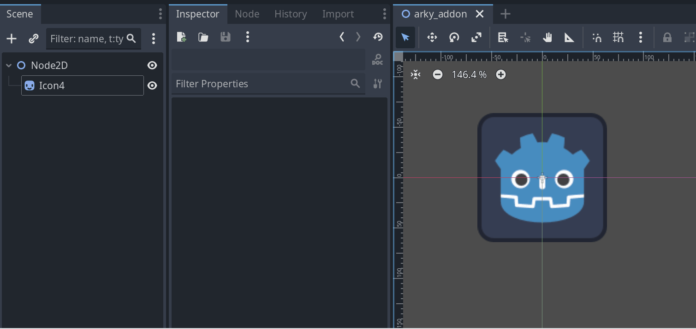
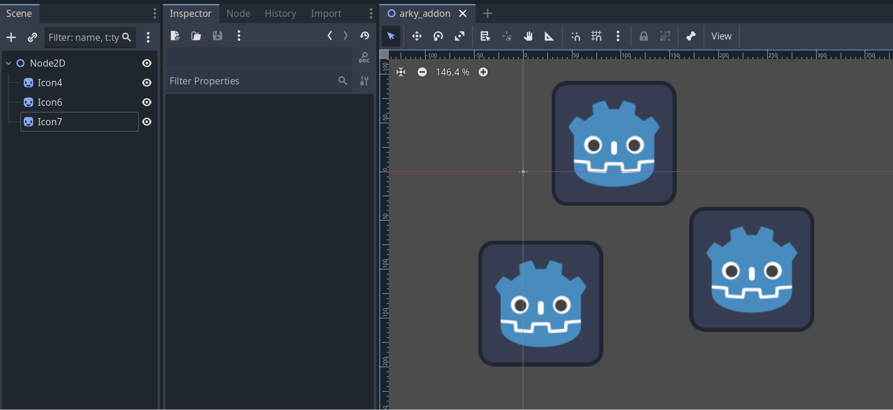

  
  

**Arky Addons** is a lightweight and modular plugin that enhances the Godot editor inspector with useful UI tools.  

Clean, minimal, and made for devs who care about workflow. 💼✨

---

## ✨ Features

- ✅ Enable/Disable node processing (`process_mode`)
- 👁️ Show/Hide node visibility
- 🎯 Reset position and scale with Undo/Redo support
- 🧩 Custom header and UI panels with native Godot styling
- 🛠️ Designed to be easily extended by other developers

---

## 🧪 Preview

### 🔘 Enabled Toggle

### 🎯 Reset Position

### 📏 Reset Scale

### 🔁 Undo/Redo Support

---

## 🚀 Installation

### 📦 Asset Library 
1. In Godot, open the `AssetLib` tab.
2. Search for and select **Arky Addons**.
3. Download then install the plugin.
4. Enable it inside `Project > Project Settings > Plugins`.

### 🧳 GitHub Releases
1. Download a [release build](https://github.com/ArkkyDev/arky-addons/releases/tag/v1.0.0).
2. Extract the zip and move `addons/arky_addons` into your project root.
3. Enable the plugin inside `Project > Project Settings > Plugins`.

### 🧪 GitHub Main (Latest - Unstable)
1. Download the latest [`main branch`](https://github.com/ArkkyDev/arky-addons/archive/refs/heads/main.zip).
2. Extract and move `addons/arky_addons` into your project root.
3. Enable it via `Project > Project Settings > Plugins`.

---

## 🌐 Languages

### 📄 [Español](https://github.com/ArkkyDev/arky-addons/blob/main/README_ES.md)
---

📄 [MIT License](https://github.com/ArkkyDev/arky-addons/blob/main/LICENSE)
