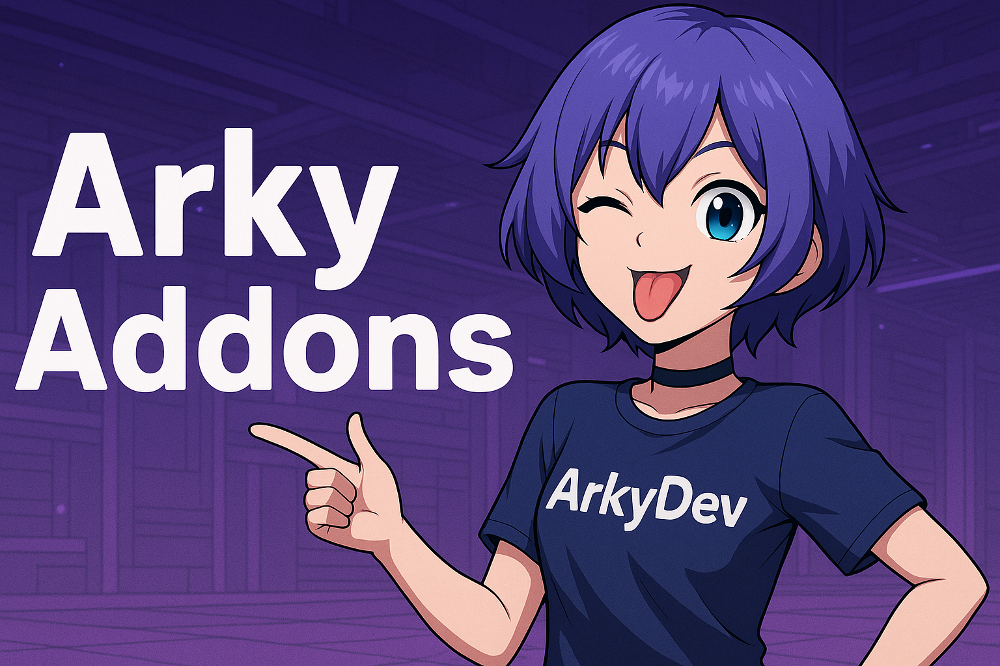
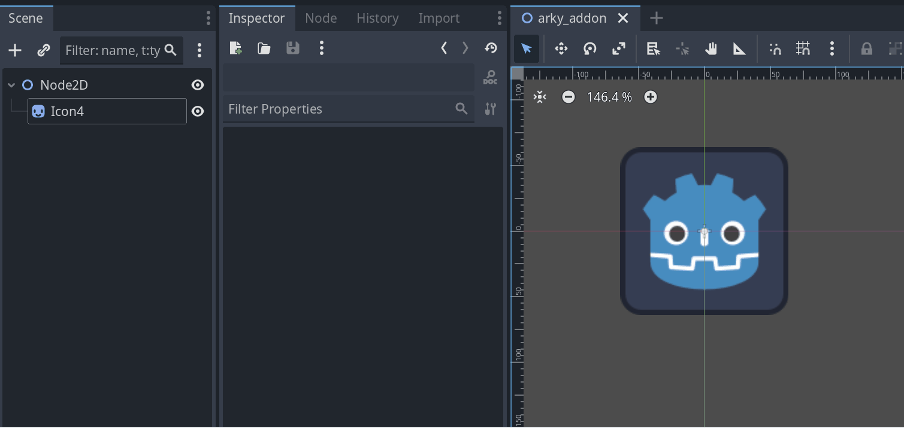
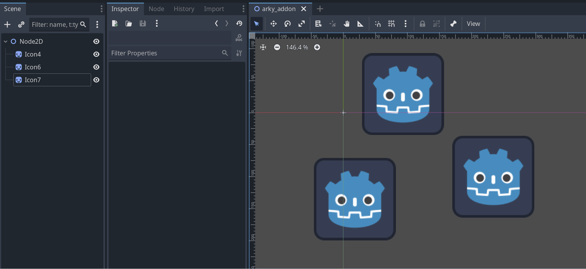

  
  

**Arky Addons** es un plugin modular y liviano que mejora el panel del inspector en el editor de Godot con herramientas útiles y limpias.  

Minimalista, funcional y hecho para desarrolladores que valoran un buen flujo de trabajo. 💼✨
****

## ✨ Funcionalidades

- ✅ Activar/desactivar el procesamiento del nodo (`process_mode`)
- 👁️ Mostrar/Ocultar visibilidad del nodo
- 🎯 Restablecer posición y escala con soporte para Undo/Redo
- 🧩 Encabezado personalizado con estilo nativo de Godot
- 🛠️ Diseñado para ser fácilmente extendido por otros desarrolladores

---

## 🧪 Vista previa

### 🔘 Activar/Desactivar

### 🎯 Restablecer posición

### 📏 Restablecer escala

### 🔁 Soporte para deshacer/rehacer

---

## 🚀 Instalación

### 📦 Desde la Asset Library 
1. En Godot, abre la pestaña `AssetLib`.
2. Busca y selecciona **Arky Addons**.
3. Descarga e instala el plugin.
4. Actívalo en `Proyecto > Configuración del proyecto > Plugins`.

### 🧳 Desde GitHub Releases
1. Descarga una [versión publicada](link/).
2. Extrae el archivo ZIP y mueve `addons/arky_addons` a la raíz de tu proyecto.
3. Actívalo en `Proyecto > Configuración del proyecto > Plugins`.

### 🧪 Desde la rama principal de GitHub (última versión - inestable)
1. Descarga la última versión desde [`main branch`](https://github.com/ArkkyDev/arky-addons/archive/refs/heads/main.zip).
2. Extrae y mueve `addons/arky_addons` a la raíz de tu proyecto.
3. Actívalo en `Proyecto > Configuración del proyecto > Plugins`.

---

## 🌐 Otros idiomas

### 📄 [English](https://github.com/ArkkyDev/arky-addons/blob/main/README.md)

---

📄 [Licencia MIT](https://github.com/ArkkyDev/arky-addons/blob/main/LICENSE)
